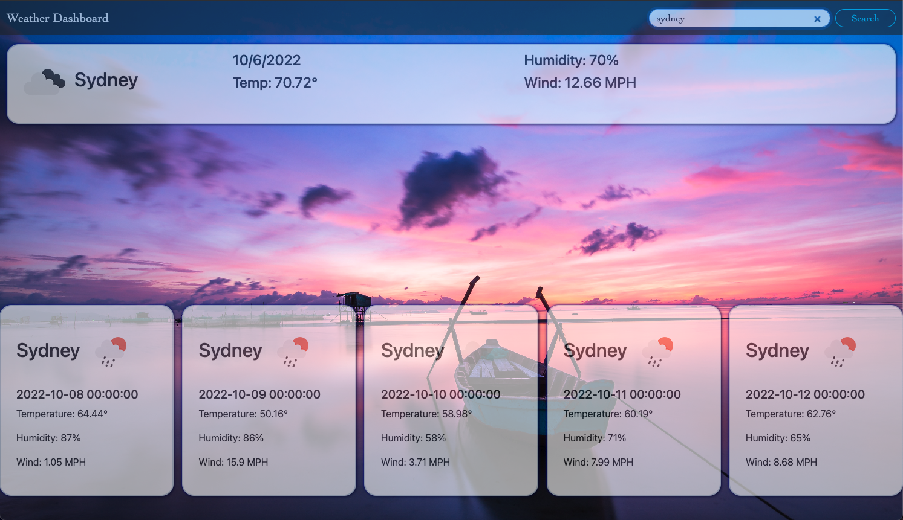

# Climate-Change

## Description

Weather dashboard to display current and five day forecast based on users city of choose!

## Table of Contents (Optional)

If your README is long, add a table of contents to make it easy for users to find what they need.

- [Installation](#installation)
- [Usage](#usage)
- [Credits](#credits)
- [License](#license)

## Installation

Download content folder enjoy!

 Site Link--- (https://frozzel.github.io/Climate-Change/)

## Usage

    
## Credits
Dennis Hickox (https://github.com/frozzel)

Materializecss (https://materializecss.com/getting-started.html)

OpenWeatherMap  (https://openweathermap.org/current)

OpenWeatherMap  ( https://openweathermap.org/weather-conditions)

## License

YOu Can Do What Ever yOu lIkE ;)
